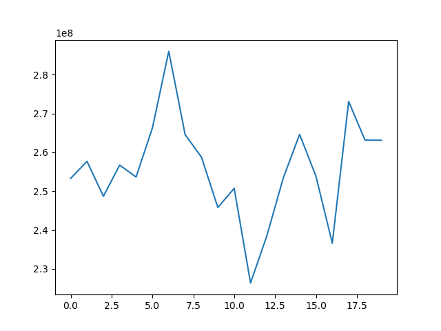
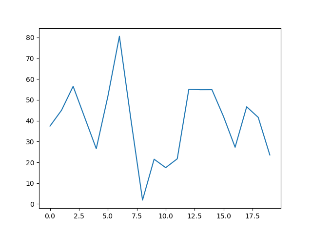
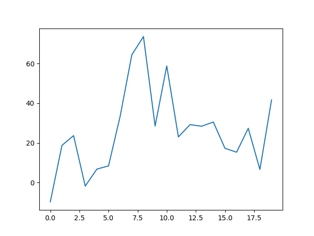
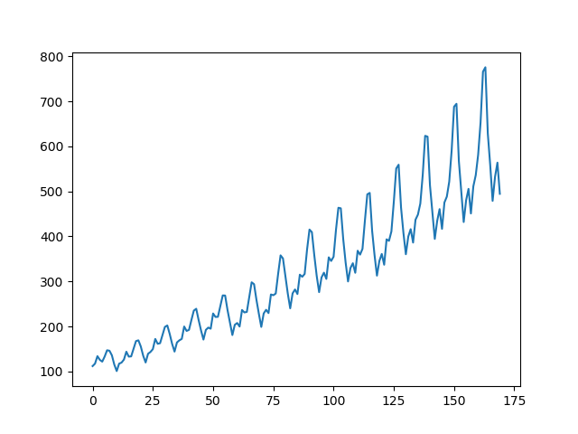

# ts-generator

Generate time series using Hidden Markov Models and Singular Spectrum analysis

# Usage

```
usage: generate.py [-h] --method {hmm-learn,hmm-param-simple,hmm-param,ssa}
                   --length n [-o output.csv] [--time-increment t]
                   [--scaling min max] [--display] [--hmm-training data.csv]
                   [--hmm-components k] [--hmm-iterations N] [--show-progress]
                   [--hmm-simple-means m [m ...]] [--hmm-means m [m ...]]
                   [--hmm-cov c [c ...]] [--hmm-start-prop s [s ...]]
                   [--hmm-trans-prop t [t ...]] [--ssa-original data.csv]
                   [--ssa-window k] [--ssa-components c]

Generate Time Series

optional arguments:
  -h, --help            show this help message and exit

general:
  --method {hmm-learn,hmm-param-simple,hmm-param,ssa}
                        choose
  --length n            number of samples
  -o output.csv, --output output.csv
                        output file, stdout if none
  --time-increment t    time increments
  --scaling min max     scale result by so that the given min and max are
                        fullfilled
  --display             display using matplotlib

hmm-learn:
  --hmm-training data.csv
                        training data: one series per line
  --hmm-components k    hmm #components
  --hmm-iterations N    learning #iterations
  --show-progress       progress during learning

hmm-param-simple:
  --hmm-simple-means m [m ...]
                        set of means

hmm-param:
  --hmm-means m [m ...]
                        set of means len=k
  --hmm-cov c [c ...]   set of covariances len=k
  --hmm-start-prop s [s ...]
                        start probabilitis len=k
  --hmm-trans-prop t [t ...]
                        transition probabilitis len=k**2

ssa:
  --ssa-original data.csv
                        base time series
  --ssa-window k        should be a multiple of the seasonality
  --ssa-components c    # of components used in reconstruction
```

# Examples
`python generate.py --method hmm-learn --hmm-training wikipedia-overall-2019-list.csv --hmm-components 4 --hmm-iterations 10 --show-progress --length 20 --display`



`python generate.py --method hmm-param-simple --length 20 --hmm-simple-means 10 30 40 70 --display`



`python generate.py --method hmm-param --length 20 --hmm-means 10 30 40 70 --hmm-cov 144 144 144 144 --hmm-start-prop 0.25 0.25 0.25 0.25 --hmm-trans-prop 0.625 0.125 0.125 0.125 0.125 0.625 0.125 0.125 0.125 0.125 0.625 0.125 0.125 0.125 0.125 0.625 --display`



`python generate.py --method ssa --length 170 --ssa-original airpassenger-list.csv --ssa-window 36 --ssa-components 13 --display`


